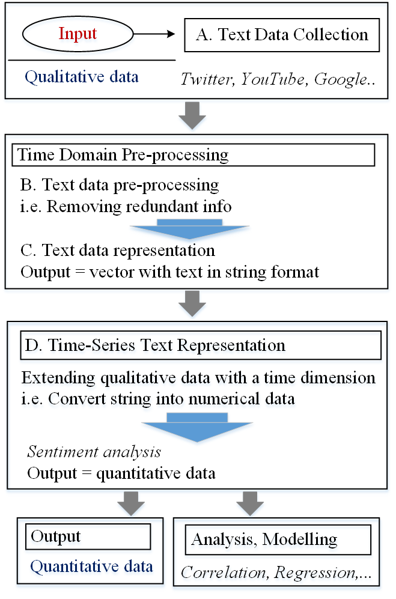

# Text Data Pre-processing for Time-series Models

Python code for **Text Data Pre-processing for Time-series Models**, *Towards Data Science (Medium)*, 2023-02-09. Article available from [here](https://towardsdatascience.com/text-data-pre-processing-for-time-series-models-162c0d01f5c5?sk=548f894cf126c09e31d52b87171880bf)

 

   
  

